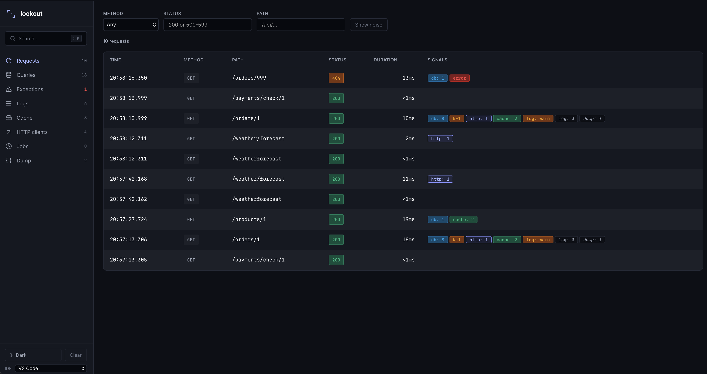
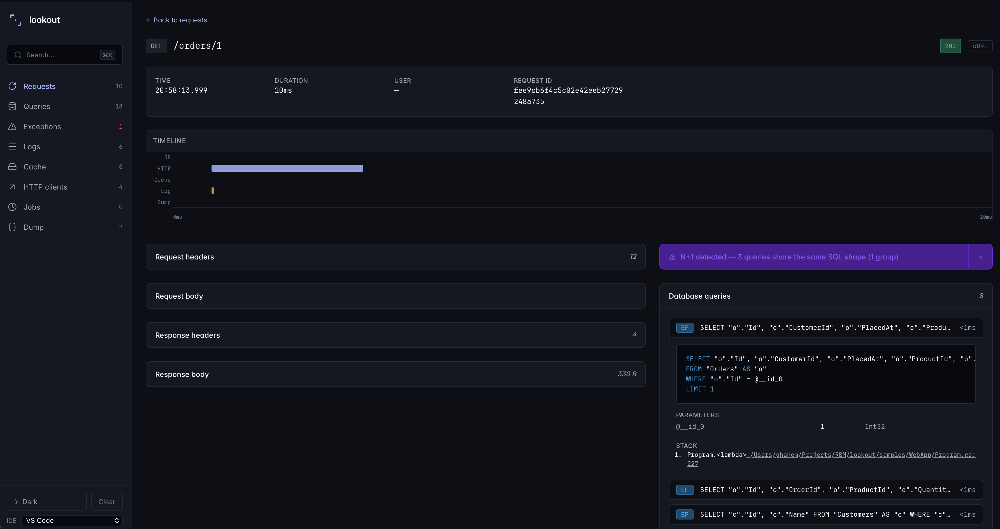

<div align="center">
  

  <h1>Lookout for ASP.NET Core</h1>

  <p>Zero-config dev-time diagnostics dashboard for ASP.NET Core.</p>

  [](https://www.nuget.org/packages/Lookout.AspNetCore/)
  [](https://www.nuget.org/packages/Lookout.Hangfire/)
  [](https://github.com/a-ghanem1/Lookout/actions/workflows/ci.yml)
  [](LICENSE)
  [](https://dotnet.microsoft.com)

  <p>
    Captures HTTP requests, EF Core queries with N+1 detection, outbound HTTP, cache hits/misses,<br/>
    exceptions, logs, Hangfire jobs, and <code>Lookout.Dump()</code> — all correlated per-request in a browser dashboard.
  </p>

  
</div>

---

## Install

```
dotnet add package Lookout.AspNetCore
```

For Hangfire job capture:

```
dotnet add package Lookout.Hangfire
```

---

## Quickstart

Three lines in `Program.cs`:

```csharp
builder.Services.AddLookout();

app.UseLookout();
app.MapLookout(); // dashboard at /lookout
```

Run your app and open `https://localhost:{port}/lookout`. Your first request appears the moment you hit any endpoint — no database setup, no configuration file.

> **Dev-only by default.** Lookout throws `LookoutEnvironmentException` at startup if `IsDevelopment()` is false, unless you explicitly set `AllowInProduction = true` or `AllowInEnvironments = ["Staging"]`. There is no silent production exposure.

---

## What it captures

| Capture point | What you get |
|---|---|
| **HTTP Requests** | Method, path, status, duration, headers, user identity, body (opt-in) |
| **EF Core Queries** | SQL text, parameters, duration, rows affected, stack trace to your code |
| **N+1 Detection** | Flags 3+ identical-normalised queries per request with a grouped banner |
| **Raw ADO.NET / Dapper** | Via `SqlClientDiagnosticListener` (SQL Server); de-duped against EF |
| **Outbound HTTP** | All `HttpClient` calls via auto-registered `DelegatingHandler` |
| **Memory Cache** | `IMemoryCache` get (hit/miss), set, remove — hit ratio per key |
| **Distributed Cache** | `IDistributedCache` get/set/refresh/remove, provider tagged |
| **Exceptions** | Handled and unhandled — type, message, inner exceptions, stack |
| **Logs** | All `ILogger` output, scoped to the active request; level-filterable |
| **Hangfire Jobs** | Enqueue → execution cross-linked; child EF/HTTP/cache/log captures inside jobs |
| **`Lookout.Dump()`** | Inline object inspection from anywhere — caller file + line attached |

All entries are correlated by request ID and searchable full-text (SQLite FTS5).

---

## Screenshots

<table>
  <tr>
    <td></td>
    <td></td>
  </tr>
  <tr>
    <td align="center"><em>Request list — signal badges surface db, http, cache, log, job counts</em></td>
    <td align="center"><em>N+1 banner — 12 identical queries grouped, stack trace to your code</em></td>
  </tr>
</table>

---

## Dashboard features

- **Telescope-style navigation** — dedicated list page per capture type: Requests, Queries, Exceptions, Logs, Cache, Jobs, Dump, HTTP Clients
- **Full-text search** — `Cmd+K` / `Ctrl+K` across all entries and tags
- **Keyboard navigation** — `j`/`k` to move, `Enter` to open, `Esc` to go back
- **Mini-Gantt timeline** — per-request coloured bars for each capture type
- **Dark mode** — system / light / dark cycle, persisted across sessions
- **Source links** — stack frames open directly in VS Code or Rider
- **Tag-based filtering** — click any tag chip to filter across all sections
- **"Copy as cURL"** — on every request detail

---

## Security

Lookout is built to stay safe in shared dev environments:

- **Dev-only by default** — throws at startup in Production unless explicitly opted in via `AllowInProduction = true`
- **Loopback-only by default** — warns at startup if bound to a non-loopback address; set `AllowNonLoopback = true` to suppress
- **CSRF protection** — all mutating endpoints require a double-submit cookie (`__lookout-csrf`) + `X-Lookout-Csrf-Token` header
- **Retention bounded** — 24-hour time window (configurable) + 50,000 entry cap; background pruning keeps storage in check

See the [Security model](https://a-ghanem1.github.io/Lookout/docs/security) docs page for the full picture.

---

## Configuration

All options are set via `AddLookout(options => { ... })`. Everything has a sane default — you only touch what you need.

```csharp
builder.Services.AddLookout(options =>
{
    options.RetentionWindow        = TimeSpan.FromHours(24); // default
    options.MaxEntries             = 50_000;                 // default
    options.CaptureRequestBody     = false;                  // opt-in
    options.CaptureResponseBody    = false;                  // opt-in
    options.Ef.N1DetectionMinOccurrences = 3;               // default

    // Allow in non-Production environments
    options.AllowInEnvironments    = ["Staging"];
});
```

Full reference at [a-ghanem1.github.io/Lookout/docs/configuration](https://a-ghanem1.github.io/Lookout/docs/configuration).

---

## Demo

- **[60-second demo](https://youtube.com/watch?v=TODO)** — find an N+1 bug in 10 seconds
- **[5-minute walkthrough](https://youtube.com/watch?v=TODO)** — every capture type, end to end

---

## Documentation

Full docs at **[a-ghanem1.github.io/Lookout](https://a-ghanem1.github.io/Lookout)**:

- [Quickstart](https://a-ghanem1.github.io/Lookout/docs/quickstart) — under 2 minutes to first capture
- [Configuration reference](https://a-ghanem1.github.io/Lookout/docs/configuration)
- [Custom capture points](https://a-ghanem1.github.io/Lookout/docs/extensibility)
- [Security model](https://a-ghanem1.github.io/Lookout/docs/security)
- [Troubleshooting](https://a-ghanem1.github.io/Lookout/docs/troubleshooting)
- [Comparison to MiniProfiler and Aspire Dashboard](https://a-ghanem1.github.io/Lookout/docs/comparison)

---

## Comparison

| | Lookout | MiniProfiler.NET | Aspire Dashboard |
|---|:---:|:---:|:---:|
| Zero-config install | ✅ | ✅ | ❌ requires AppHost |
| N+1 detection | ✅ | ❌ | ❌ |
| Exception + log capture | ✅ | ❌ | partial |
| Cache capture | ✅ | ❌ | ❌ |
| Hangfire job capture | ✅ | ❌ | ❌ |
| Standalone browser dashboard | ✅ | in-page widget | ✅ |
| Production observability | ❌ dev-only | ❌ | ✅ |
| Last major release | 2026 | 2022 | active |

Lookout is complementary to both, not a replacement. MiniProfiler's in-page widget is great for timing SQL in production pages; Aspire Dashboard is a full production observability platform. Lookout is the tool you run during development when you want to understand exactly what a single request did.

---

## Contributing

Issues and pull requests are welcome. The [v2 wishlist issue](https://github.com/a-ghanem1/Lookout/issues) tracks planned additions — a good place to find a first contribution.

Planned community PR targets post-v1: Quartz.NET, MassTransit, Wolverine, gRPC capture, `IEmailSender` / MailKit.

---

## License

MIT — see [LICENSE](LICENSE).
